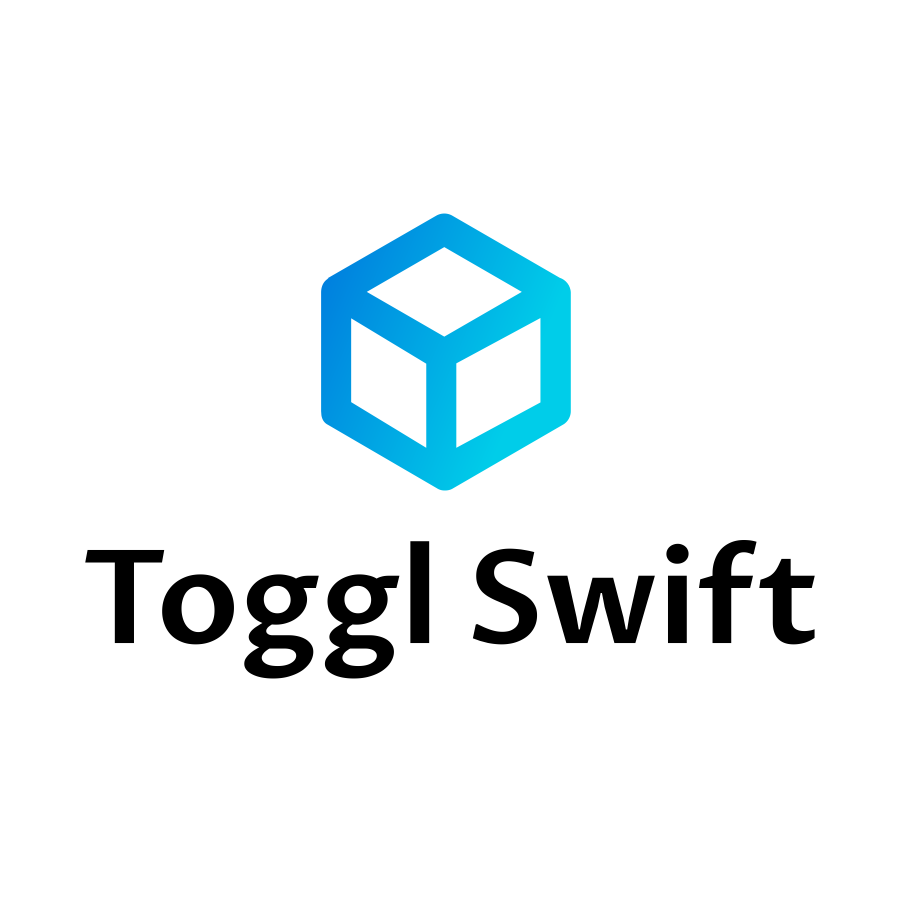

<p align="center">
  
</p>

# 👩‍🚀 Toggl Swift

[](https://travis-ci.org/NghiaTranUIT/Toggl-Desktop)
[](https://github.com/Carthage/Carthage)

Toggl Swift is a wrapper of [Toggl-api-v8](https://github.com/toggl/toggl_api_docs), which is dedicatedly writeen by pure **Swift** and **No Dependency**.

It's obvious that we don't want to introduce any unnecessary dependency, such as Alamofire, Moya to your project 👨‍💻

## Project Status and Roadmap

This project is actively under development. We don't consider it ready for production use.

- [x] Foundation of Toggl Swift
- [x] Support [Authentication APIs](https://github.com/toggl/toggl_api_docs/blob/master/chapters/authentication.md)
- [x] Partital complete Unit Tests for all components
- [x] macOS Example app
- [x] Support Carthage
- [ ] Client, Group, Tag, Task, ... APIs
- [ ] Report APIs
- [ ] RxSwift Extension

## Structure
`Toggl Swift` is designed in the flexibility manner. We are free to provide your desired URLSession, Serializer, Plugins

We've inspired the idea from Moya, which means that we abstract the nasty Networking layer by introducing the `APIRoute` enum.

By using this approach, there are positive benefits.
1. Hide the complexity of URLSession or Alamofire behind the scene from the client.
2. Use API Route enum as a first-citizen by defining clearly the routes.
3. Hide the business logic and strengthen readability and testable.

### API Routes
```swift
public enum APIRoute {

    case loginEmail(LoginEmailParameter)
    case loginAPIToken(LoginTokenParameter)
    case loginWithSession(LoginTokenParameter)
    case project
    case ...
}
```

### Network Service
`NetworkService` is capable of injecting your custom classes. Rather than one god class has really big responsibilities, it dedicatedly delegates to other guys, who are really good at it. For instance, `Fetchable`, `Serializable`, `PluginType`, `ValidatorType`, ...

Therefore, it's super flexible to you to integrate to your own app.

```swift
public final class NetworkService: NetworkServiceType {

    // MARK: - Variable
    private let fetcher: Fetchable
    private let serializer: Serializable
    private let plugins: [PluginType]
    private let statusCodeValidator: ValidatorType // future
}
```

## Sample Projects
We have provided 1 sample macOS projects in the repository.

1. Clone Toggl Swift
2. Open `DesktopWorksapce.xcworkspace`
3. Make sure we're choosing Desktop-Toggl
4. Run and Happy coding 👨‍💻

## Installation

### Requirement
- Swift 4.2

### Carthage

Make the following entry in your Cartfile:

```
github "NghiaTranUIT/Toggl-Swift"
```

Then run `carthage update`.

If this is your first time using Carthage in the project, you'll need to go through some additional steps as explained [over at Carthage](https://github.com/Carthage/Carthage#adding-frameworks-to-an-application).

### Manually

1. Download the latest `TogglCore.framework` from [Release](https://github.com/NghiaTranUIT/Toggl-Swift/releases)
2. Add `TogglCore.framework` to your project
3. Happy coding! 😍

## Usage

### Login exmaple 

```swift
// Define your URLSession
let urlSession = URLSession(configuration: .default)

// JSON Serializer
// Or XML, Thrift, ... by adopting the Serializable protocol
let jsonSerializer = JSONSerializer()

// Plugings
let plugins = [LoggerPlugin()]

// Initialize
let network = NetworkService(fetcher: urlSession, serializer: jsonSerializer, plugins: plugins)

// Param
let param = LoginEmailParameter(email: "john.doe@gmail.com", password: "Toggl")

// Login with Email and password
network.request(APIRoute.loginEmail(param), type: User.self) { (result) in
    switch result {
    case .error(let error):
        // Show Error Alert here
        break
    case .success(let user):
        // Get the user
        print(user.fullName)
        break
    }
}
```

### Extensions
We provide many convenience extensions to you in order to integrate your app seamlessly.
```swift
/// Convenience extension
extension NetworkServiceType {

    /// Login with email and password
    public func login(email: String, password: String, complete: @escaping (Result<User>) -> Void)

    /// Login with API token
    public func login(apiToken: String, complete: @escaping (Result<User>) -> Void)

    /// Login with session
    public func loginSession(apiToken: String, complete: @escaping (Result<User>) -> Void)
}
```
Then we can call the login func directly.
```swift
network.login(email: "john.doe@gmail.com", password: "Toggl") { (result) in
    switch result {
    case .error(let error):
        // Show Error Alert here
        break
    case .success(let user):
        // Get the user
        print(user.fullName)
        break
    }
}
```

## License
`Toggl Swift` is released under an MIT license. See LICENSE for more information.
